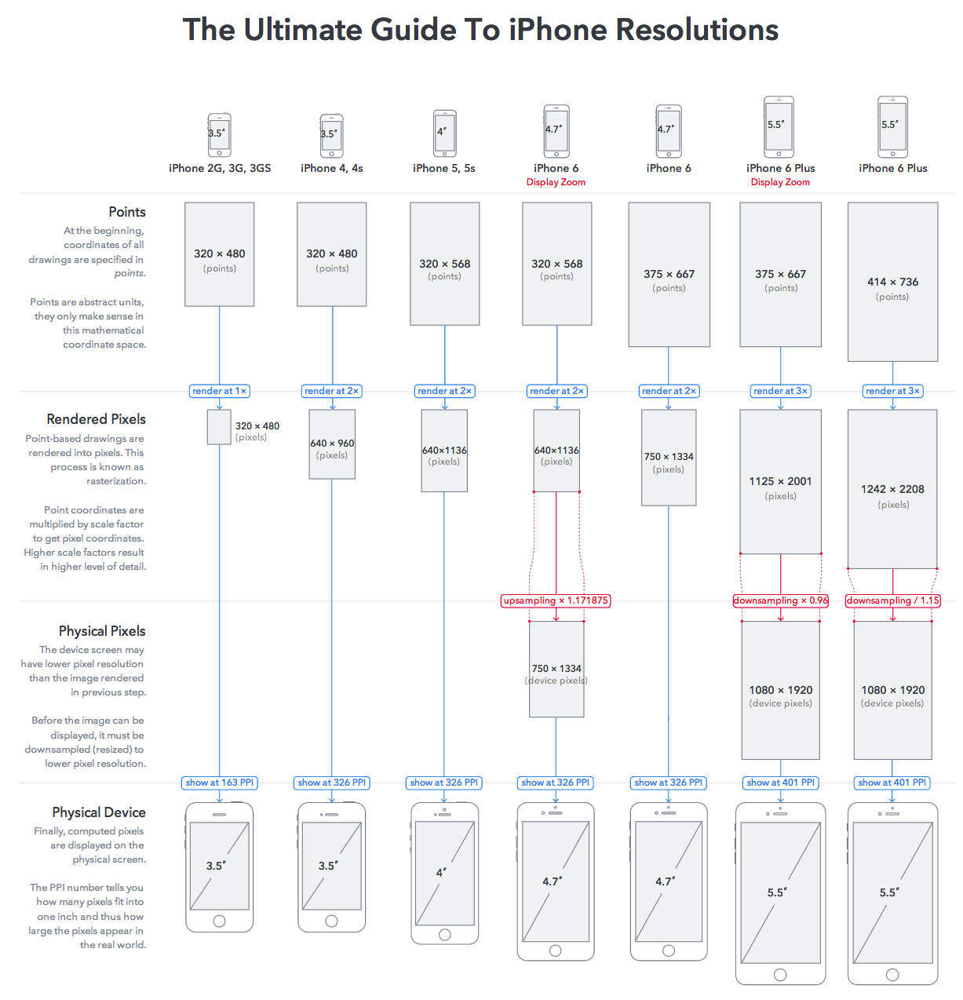

###iOS 布局篇
随着iOS设备的多样化，从iPhone 3GS、iPhone 4s的3.5英寸屏幕到现在如今iPad Pro 的12.9英寸屏幕，其分辨率也由320x480、640x960涨到了1080x1920、2732 x2048。要想用一套代码让所有设备都完美的适配，布局问题已经尤为重要了。

####1、屏幕
想要做到完美适配，首先要了解iOS所有家族的屏幕：

这个图可能不全，没有6s、6sp、ipad等系列的展示。

关于屏幕我们只需要了解以下几点：屏幕尺寸、实际分辨率、逻辑分辨率、缩放系数
。这个在我们实际应用中都有很大的作用，具体的获取方法，有的可以通过UIDevice里获取，我们一般会根据这些信息来判断是什么机型，从而选不同分辨率的图片，做不同的布局，从而让渲染效果达到最佳。
#####1.1 逻辑分辨率
   和安卓无数混乱的机型和分辨率相比，苹果还是很人道的，虽然苹果设备的分辨率也一年一样，但好心得苹果给了开发者一个小小的福利，就是所谓的逻辑
